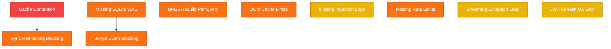

# Backend Audit & Reliability Report

**Analysis Date:** 2026-07-09  
**Milestone:** v10.0  
**Scope:** Python FastAPI / SQLite / ChromaDB / LangChain / Groq Backend  

---

## Executive Summary

A comprehensive static analysis and code review of the `document-rag` Python backend has been performed. While the system provides robust user-level data isolation and core functionality, we identified several critical bottlenecks and vulnerability areas that limit concurrent performance and scale.

The primary issues cluster around **concurrency cache contention**, **event loop stalling** by synchronous blocking I/O (Bcrypt and SQLite), **excessive redundant disk reads** during hybrid retrieval, and **lack of error observability** in background tasks.

---

## Detailed Findings by Severity

---

### Critical Severity

#### 1. Chroma Cache Connection Locking Contention
- **Location**: `backend/app/core/vectorstore.py` (lines 69–101) inside [ChromaConnectionCache.get()](file:///d:/Learnings/document-rag/backend/app/core/vectorstore.py#L77-L100)
- **Condition**: Instantiating a new `Chroma` client connection (which reads/writes index files from/to disk via SQLite) is done *inside* the global thread lock block (`with cls._lock:`).
- **Impact**: Any thread trying to fetch *any* client (even a cached one) is blocked from looking up their key in `cls._cache` while another thread is initializing a new Chroma client. This completely serializes access to the vector store cache, causing request queues under multi-user concurrent loads.
- **Remediation**: Re-structure cache retrieval to release the lock while initializing a new connection. Re-acquire the lock only to insert the newly created client (verifying first that another thread hasn't already inserted it).

---

### High Severity

#### 2. Synchronous Bcrypt Hashing and Verification on Event Loop
- **Location**: `backend/app/routes/auth.py` (lines 37 and 72) inside [signup()](file:///d:/Learnings/document-rag/backend/app/routes/auth.py#L35-L44) and [login()](file:///d:/Learnings/document-rag/backend/app/routes/auth.py#L69-L77)
- **Condition**: Password hashing (`bcrypt.hashpw` in `signup`) and verification (`bcrypt.checkpw` in `login`) run synchronously on the async event loop thread.
- **Impact**: Bcrypt is intentionally CPU-intensive (~300ms compute time). During registration or login attempts, the entire FastAPI single-threaded event loop is completely blocked for 300ms. All concurrent user requests (streaming responses, uploads, queries) stall during this block.
- **Remediation**: Execute password hashing and verification inside a thread pool using FastAPI/AnyIO's `run_in_threadpool()` or asyncio's `run_in_executor()`.

#### 3. Missing SQLite Write-Ahead Logging (WAL) Mode
- **Location**: `backend/app/core/database.py` (lines 55–59) inside [UserDatabaseManager.get_connection()](file:///d:/Learnings/document-rag/backend/app/core/database.py#L55-L59)
- **Condition**: Database connections are initialized without enabling WAL mode. By default, SQLite uses DELETE mode.
- **Impact**: Readers block writers, and writers block readers. Write transactions (e.g. creating a session, appending a message, registering a user) lock the database file. If a write is active, concurrent reads will either block or fail immediately with `sqlite3.OperationalError: database is locked`.
- **Remediation**: Execute `PRAGMA journal_mode = WAL;` and set `PRAGMA busy_timeout = 5000;` during connection initialization.

#### 4. Redundant BM25 Index Rebuilds and disk JSON Reads
- **Location**: `backend/app/routes/query.py` (lines 57–64) inside [retrieve_and_rerank_context()](file:///d:/Learnings/document-rag/backend/app/routes/query.py#L35-L110)
- **Condition**: A user queries multiple documents, or query expansion generates 3 alternative queries (totaling 4 query formulations). For each query and document combination, `vector_manager.get_hybrid_retriever()` is invoked.
- **Impact**: For N queried documents and 4 query variants, the backend performs `4 * N` disk reads and JSON parses of `{document_id}.json` to rebuild the `BM25Retriever` from scratch. For large documents, this creates severe CPU and disk I/O waste, causing query latency to scale poorly with document size.
- **Remediation**: Implement a bounded cache for initialized `BM25Retriever` instances (similar to `ChromaConnectionCache`), keyed by `(user_id, document_id)`.

#### 5. Blocking Ingestion Pipeline in Reindex Endpoint
- **Location**: `backend/app/routes/documents.py` (lines 388–438) inside [reindex_document()](file:///d:/Learnings/document-rag/backend/app/routes/documents.py#L276-L487)
- **Condition**: The `/reindex` route is called, which runs the parsing, chunking, saving, and Chroma indexing inline.
- **Impact**: Unlike `/upload` which correctly runs in a background thread task via `BackgroundTasks`, the `/reindex` endpoint executes everything synchronously on the main thread inside an `async def` handler. Because parsing and indexing take several seconds, the entire server event loop locks up for all users.
- **Remediation**: Offload re-indexing execution to FastAPI `BackgroundTasks`, returning an HTTP 202 status and job ID, matching the upload design.

#### 6. Oversized Chroma Connection Cache (OOM Risk)
- **Location**: `backend/app/core/vectorstore.py` (line 74) inside [ChromaConnectionCache](file:///d:/Learnings/document-rag/backend/app/core/vectorstore.py#L69-L74)
- **Condition**: Cache capacity limit is hardcoded to 100 open clients (`_max_size: int = 100`).
- **Impact**: Each active Chroma client uses 10MB to 50MB of RAM. Under concurrent use with many documents, 100 open clients will consume up to 5GB of RAM. In memory-constrained environments (e.g. Render Free Tier's 512MB RAM cap), the server will crash due to Out-Of-Memory (OOM) before evicting anything.
- **Remediation**: Expose `CHROMA_CACHE_SIZE` as an environment variable and set a conservative default of 5 to 10 for memory-constrained tiers.

#### 7. Missing Rate Limiting on Authentication and CRUD Endpoints
- **Location**: `backend/app/routes/auth.py`, `sessions.py`, `documents.py`
- **Condition**: Only `/upload` and `/query` endpoints utilize `@limiter.limit()`.
- **Impact**: Critical routes like `/auth/signup` and `/auth/login` are vulnerable to dictionary attacks and denial-of-service brute forcing. User CRUD routes for sessions and documents can be flooded to deplete server resources.
- **Remediation**: Decorate `/auth/login` and `/auth/signup` with strict rate limits (e.g. 5 requests per minute). Apply moderate limits to sessions and documents CRUD routes.

---

### Medium Severity

#### 8. Missing Ingestion Task Failure Observability
- **Location**: `backend/app/routes/upload.py` (lines 162–188) inside [run_ingestion_job()](file:///d:/Learnings/document-rag/backend/app/routes/upload.py#L59-L189)
- **Condition**: An exception (e.g., parsing crash, embedding failure, disk full) occurs inside the background ingestion task.
- **Impact**: The exception is caught, cleanup is run, and the job status is set to `"failed"`. However, the traceback is never logged. The server console and log files remain completely blank, hiding structural engine errors from developers and administrators.
- **Remediation**: Call `logging.error("Ingestion job failed", exc_info=e)` in the outer exception block.

#### 9. Lack of JWT Token Refresh and Revocation
- **Location**: `backend/app/core/auth.py`
- **Condition**: JWT access tokens are signed with a 30-minute expiry time; no token refresh endpoint or blacklist exists.
- **Impact**: Users are abruptly forced to log out and log back in every 30 minutes, degrading UX. Additionally, if a token is compromised, it cannot be revoked before it expires.
- **Remediation**: Implement a `/auth/refresh` endpoint that issues short-lived access tokens using longer-lived, database-backed refresh tokens.

#### 10. Streaming Response Exception Leak
- **Location**: `backend/app/routes/query.py` (lines 479–481) inside [sse_generator()](file:///d:/Learnings/document-rag/backend/app/routes/query.py#L463-L527)
- **Condition**: An exception other than `GroqConnectionError` or `InferenceError` occurs during streaming generation.
- **Impact**: The connection drops silently, or Uvicorn returns a broken stream with a raw Python exception. The client receives no error payload and hangs waiting for the `[DONE]` event.
- **Remediation**: Add a catch-all `except Exception as e:` block inside the generator to yield a formatted JSON error payload (`{"error": "..."}`) before closing the stream.

---

### Low Severity

#### 11. Silent Parent Resolution Failures
- **Location**: `backend/app/core/vectorstore.py` (lines 409–450) inside [resolve_parent_documents()](file:///d:/Learnings/document-rag/backend/app/core/vectorstore.py#L409-L450)
- **Condition**: JSON file reads or parsing fails inside the chunk resolver.
- **Impact**: The exception is swallowed silently, falling back to returning the child chunk. While resilient, it hides corrupted chunk JSON files or file system permission errors from system logs.
- **Remediation**: Log a warning when file read fails inside the resolver.

#### 12. Duplicate Validation Logic
- **Location**: `backend/app/routes/upload.py` and `documents.py`
- **Condition**: Both endpoints manually check `chunking_strategy`, `semantic_threshold_type`, and ranges.
- **Impact**: Minor code duplication increases maintenance overhead.
- **Remediation**: Refactor parameters into a shared validation function or a reusable Pydantic sub-model.

---

## Prioritized Remediation Roadmap

Based on the impact and complexity of implementation, we recommend prioritizing these fixes in the next milestone (`v11.0`):

| Priority | Finding | Impact | Complexity | Fix Strategy |
|---|---|---|---|---|
| **1** | **#8 Ingestion failure logging** | High | Trivial | Call `logging.error(..., exc_info=e)` in background task catch block. |
| **2** | **#3 SQLite WAL mode** | High | Low | Enable WAL mode and set busy timeout during SQLite connection bootstrap. |
| **3** | **#1 Chroma cache connection locking** | Critical | Medium | Release the lock during `Chroma` client instantiation; re-acquire to insert. |
| **4** | **#7 Rate limiting auth routes** | High | Low | Decorate `/auth/login` and `/auth/signup` with strict `@limiter.limit()`. |
| **5** | **#2 Bcrypt sync blocking** | High | Low | Wrap Bcrypt hash/verify calls in FastAPI/AnyIO `run_in_threadpool()`. |
| **6** | **#5 Reindexing endpoint async blocking** | High | Medium | Convert reindexing to run asynchronously via `BackgroundTasks` matching upload route. |
| **7** | **#4 BM25 retriever cache** | High | Medium | Implement an LRU cache for built `BM25Retriever` instances keyed by doc UUID. |
| **8** | **#6 Chroma cache OOM risk** | High | Low | Expose cache size limit as env variable; reduce default to 5-10. |
| **9** | **#10 Streaming exception catch-all** | Medium | Low | Wrap generator loops in a broad catch-all sending error event. |
| **10** | **#9 JWT Token Refresh** | Medium | High | Add refresh tokens and refresh endpoints to the auth system. |
