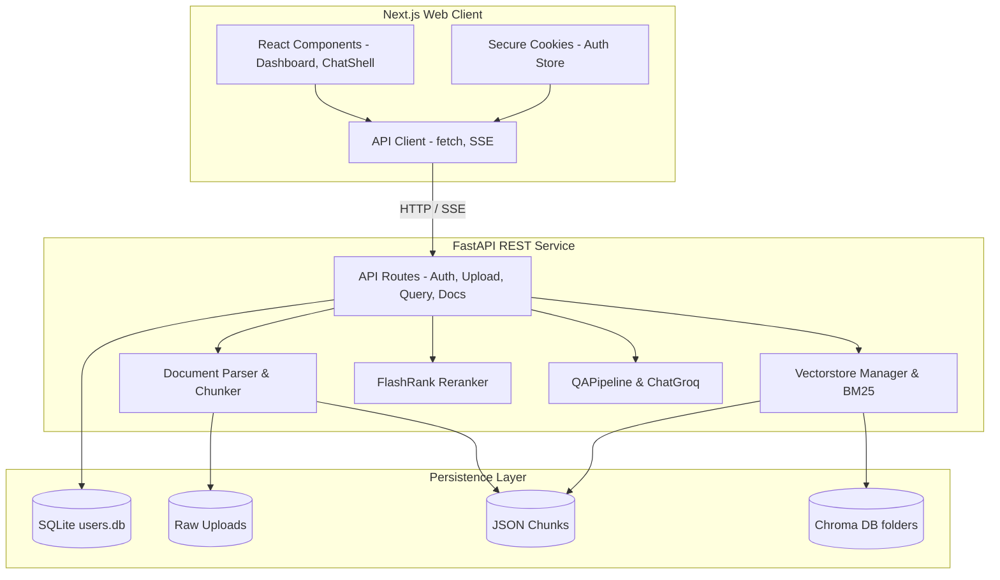

# Architecture

**Analysis Date:** 2026-07-02

## Pattern Overview

**Overall:** Decoupled Client-Server SPA Architecture. Next.js web frontend interacts with a Python modular REST API backend utilizing multi-tenancy, hybrid document retrieval, re-ranking, and streaming generation.

## Layers

### 1. Presentation Layer (Frontend Next.js)
- **Routing & Server Pages (`frontend/src/app/`)**: Handles path management (Home dashboard `/`, login screen `/login`, register screen `/register`). Server-side checks extract the active session token from cookies to pre-fetch documents.
- **Component Layouts (`frontend/src/components/`)**:
  - `DashboardShell.tsx`: High-level wrapper containing the authenticated app experience.
  - `Sidebar.tsx`: Manages active user document selection, listing uploads, and displaying log out action.
  - `ChatShell.tsx`: Orchestrates chat sessions, message rendering (with markdown parsing), citations list, and user question inputs.
  - `UploadModal.tsx`: Controls drag-and-drop file ingestion, file-type filtering, and upload progress alerts.
  - `PreviewModal.tsx`: Renders selected document text and metadata preview.
- **Client utilities (`frontend/src/lib/`)**:
  - `api-client.ts`: Standardized error catching and authorization-header injection wrapper for client fetch calls.
  - `markdown-parser.tsx`: Helper to convert AI answers containing markdown/citation tags into styled JSX nodes.

### 2. Service Layer (Backend REST Controllers)
- Exposes async HTTP endpoints, handles payload schema parsing with Pydantic, and coordinates auth guards.
- **Components:**
  - `backend/app/routes/auth.py`: Authentication routes (`POST /register`, `POST /login`).
  - `backend/app/routes/upload.py`: Document upload pipeline controller (`POST /upload`).
  - `backend/app/routes/query.py`: Synchronous (`POST /query`) and streaming (`GET /query/stream`) RAG endpoints.
  - `backend/app/routes/documents.py`: Document listing (`GET /documents`) and deletion (`DELETE /documents/{id}`) endpoints.

### 3. Business Logic Layer (RAG & Security Engines)
- Coordinates security operations, parses text, and conducts hybrid lookup pipelines.
- **Components:**
  - `backend/app/core/auth.py`: JWT key signing, hash verification, and dependency security guards.
  - `backend/app/core/database.py`: Handles low-level SQLite queries for user persistence.
  - `backend/app/core/parsers.py` / `chunker.py`: Document parsing and character/semantic splitting logic.
  - `backend/app/core/vectorstore.py`: Embedded-index building (Chroma) and hybrid retrieval matching.
  - `backend/app/core/reranker.py`: Candidate sorting using the local FlashRank model.
  - `backend/app/core/qa.py`: LLM prompt-building and answer generation.

### 4. Storage & Persistence Layer
- Holds files, indexes, and user accounts.
- **Locations:**
  - SQLite Database (`backend/data/users.db`)
  - User Document Vault (`backend/data/uploads/{user_id}/`)
  - Document Chunks Folder (`backend/data/chunks/{user_id}/{document_id}.json`)
  - Chroma Collections (`backend/data/vectorstore/{user_id}/{document_id}/`)

## Data Flow

### 1. Ingestion Flow:
1. User uploads a PDF/DOCX file in `UploadModal.tsx`.
2. The file is sent via `api-client.ts` (`POST /upload`) containing the Bearer token.
3. FastAPI's upload router saves the file, parses it, chunks it, and saves metadata.
4. Chunks are embedded and indexed into the user's isolated Chroma database directory.
5. Frontend receives the completion alert and updates the document sidebar list.

### 2. Streaming Q&A Flow:
1. User enters a question in `ChatShell.tsx`.
2. Client issues a `GET /query/stream?question=...&document_ids=...` request using an `EventSource`-style fetch.
3. The server runs hybrid retrieval on the active indices, sorts candidates via FlashRank, and swaps chunks for parent documents.
4. Server constructs the prompt and requests a streaming completion from ChatGroq.
5. Server yields tokens chunk-by-chunk using `Server-Sent Events (SSE)`.
6. `ChatShell.tsx` listens to the stream, updates message state in real-time, and resolves citations once the stream closes.
