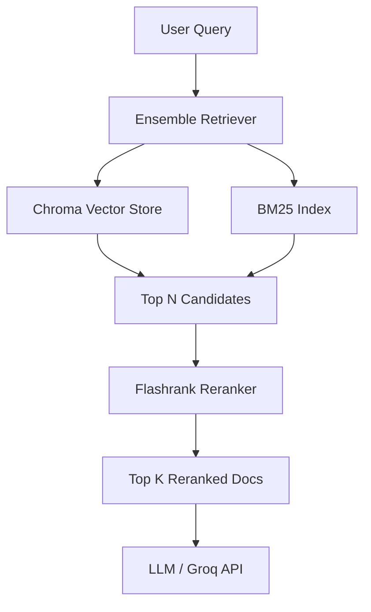

# Technical Research: Architecture for Advanced Retrieval

**Date:** 2026-06-19
**Milestone:** v1.3

## System Integration & Data Flow

### 1. Ingestion Pipeline
- During `/upload`, the parsed documents are chunked and saved to `data/chunks/{user_id}/{document_uuid}.json`.
- In addition to indexing the chunks into the Chroma vector store under `data/vectorstore/{user_id}/{document_uuid}/`, we also need to enable BM25 indexing.
- Since BM25 in LangChain (`BM25Retriever`) is an in-memory index, we must persist it to disk. 
- **Persistence Strategy:** Serialize the `BM25Retriever` (or the underlying dictionary of documents/frequencies) using Python's `pickle` library, saving it as `data/vectorstore/{user_id}/{document_uuid}/bm25.pkl`. This keeps all indexing files for a document grouped under the same multi-tenant folder.

### 2. Retrieval Pipeline
- When a user calls `/query` with `document_id`:
  - Load the Chroma vector store retriever from `data/vectorstore/{user_id}/{document_uuid}/`.
  - Load the BM25 retriever by deserializing `bm25.pkl` from the same directory.
  - Wrap both in an `EnsembleRetriever` with weights `[0.5, 0.5]`.
  - Instantiate a local `FlashrankRerank` compressor/reranker.
  - Combine the `EnsembleRetriever` and `FlashrankRerank` into a `ContextualCompressionRetriever`.
  - Invoke the compressed retriever to fetch the top `K` highly relevant contexts for the LLM chain.

---
*Research focus: Architecture*
