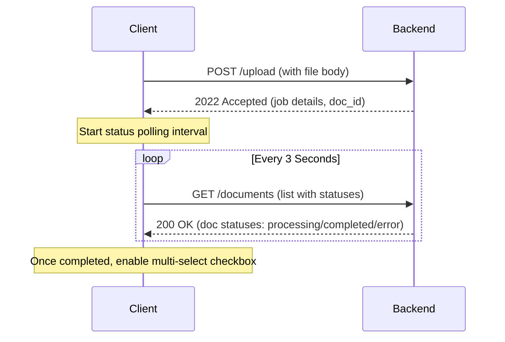

# Architecture Research

**Domain:** Web Frontend Client for Document RAG REST API
**Researched:** 2026-06-27
**Confidence:** HIGH

## Architecture Overview

The client-side web interface will be structured as a standalone Next.js App Router application nested inside the `/frontend` directory of the project repository. It interfaces directly with the backend REST API running at `http://localhost:8000`.

## Component Structure

```text
frontend/
├── src/
│   ├── app/
│   │   ├── layout.tsx         # Global fonts, layouts, and Authentication Provider
│   │   ├── page.tsx           # Dashboard view with summary cards and stub content
│   │   ├── login/
│   │   │   └── page.tsx       # Login screen
│   │   ├── register/
│   │   │   └── page.tsx       # Registration screen
│   │   └── chat/
│   │       └── page.tsx       # Main multi-turn Q&A chat panel with sidebars
│   ├── components/
│   │   ├── Sidebar.tsx        # Chat sessions lists and document selectors
│   │   ├── ChatPanel.tsx      # Chat bubbles, SSE listener, and scroll locks
│   │   ├── UploadModal.tsx    # Drag-and-drop document uploader
│   │   └── DocumentList.tsx   # Dashboard listing with process status polling
│   └── lib/
│       ├── api-client.ts      # Custom fetch wrapper injects JWT and handles streaming API
│       └── utils.ts           # Class merges and format helpers
├── tailwind.config.js         # Theme variables (dark mode, glass overrides)
└── package.json
```

## Data Flow

### 1. Request Interception & Authentication
- Authenticated state is managed globally by an `AuthProvider` context.
- The `api-client.ts` acts as a request helper:
  - Fetches the JWT token from `localStorage` and appends it as `Authorization: Bearer <token>` to headers.
  - Intercepts `401 Unauthorized` errors to wipe local tokens and redirect the browser to `/login`.

### 2. Document Processing & Status Polling


### 3. Server-Sent Events (SSE) Streaming
- When querying on `/query/stream`, the client performs a standard `fetch` with the `session_id` and list of `document_ids`.
- Rather than waiting for the entire JSON payload, the client reads the response body stream chunk-by-chunk using a reader:
  ```typescript
  const response = await fetch("/query/stream", ...);
  const reader = response.body.getReader();
  const decoder = new TextDecoder();
  while (true) {
    const { value, done } = await reader.read();
    if (done) break;
    const chunk = decoder.decode(value);
    // Parse SSE text and append to assistant bubble
  }
  ```
